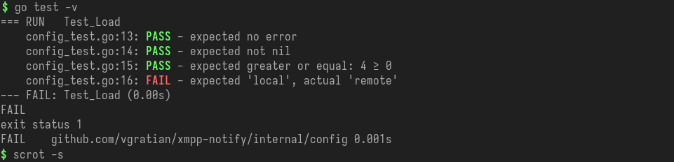

Helper functions for testing with color highlighting of passing and failing tests. This makes it easier to spot failing tests when you have a big chunk of tests running.

The library contains two packages, `expect` and `assert` which provide identical set of functions, but `expect` will continue execution after failure, while `assert` will abort.

The output looks something like this:



## Examples

Numeric comparison:
```go
package add

import (
	"github.com/vgratian/go-testutil/expect"
	"testing"
)

// function we want to test
func Add(a,b int) int {
	return a + b
}

func TestAdd(t *testing.T) {
	x := Add(1,2)
	expect.Equal(t, 3, x)
	expect.Less(t, 2, x)
	
	y := Add(x, 1)
	expect.Greater(t, x, y)
}
```

String comparison:
```go
func TestStrings(t *testing.T) {
	a := "a"
	b := "b"
	expect.NotEqual(t, a, b)
	
	b = "a"
	expect.Equal(t, a, b)
}
```

Slice comparison:

```go
func TestSlices(t *testing.T) {
	x := []float32{0.1, 0.001}
	y := []float32{0.1, 0.001}
	expect.EqualSlice(t, x, y) // will pass
	
	a := []string{"a", "b"}
	b := []string{"b", "a"}
	expect.EqualSlice(t, a, b) // will fail
}
```

Error and pointer validation
```go
package example

import (
	"github.com/vgratian/go-testutil/assert"
	"github.com/vgratian/go-testutil/expect"
	"testing"
)
func TestWithGoodArgs(t *testing.T) {
	obj, err := GetObj("good args")
	assert.NoError(t, err) // assert: stop execution on error
	assert.NotNil(t, obj)
	// continue testing ...
	expect.Greater(t, obj.Count, 0)
	// ...
}

func TestWithBadArgs(t *testing.T) {
	obj, err := GetObj("bad args")
	expect.Error(t, err)
	expect.Nil(t, obj)
}
```
